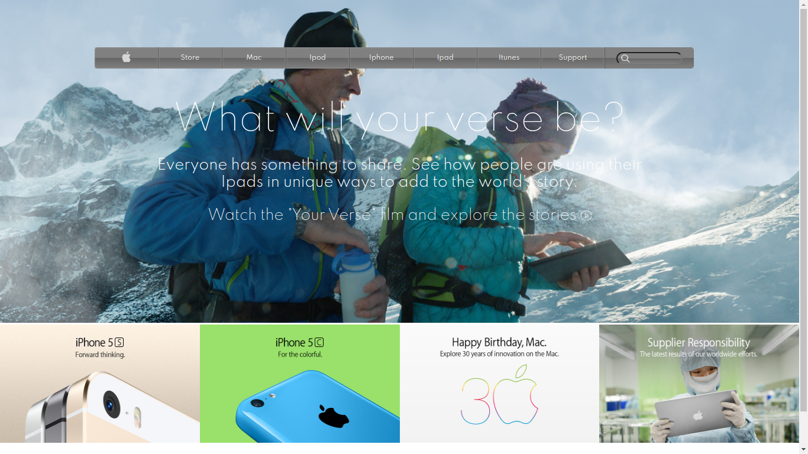

# Positioning-and-Floating-Elements

​
This project was built to strengthen our Knowledge on using different backgrounds and background properties in CSS.
​

## Built With

- HTML
- CSS
  ​

[Live Demo Link](https://boring-wescoff-fa0c72.netlify.app/)

​

## Getting Started

​
**To view this project, download the contents of the repository to your computer or clone the repository and open the index.html file using your preferred browser.**
​

## Authors

​
👤 **Maryjane**
​

- Github: [@maryjane](https://github.com/maryjanee)

- Twitter: [@AlfredMaryjane](https://twitter.com/AlfredMaryjane)

- Linkedin: [Maryjane Akpagbue](https://www.linkedin.com/in/maryjane-akpagbue-1500b7173/)
  ​

👤 **Aldana**
​

- Github: [@AlduLonghi](https://github.com/AlduLonghi)

- Twitter: [@AbrilLonghi](https://twitter.com/AbrilLonghi)

- Linkedin: [Aldana Abril Longhi](https://www.linkedin.com/in/aldana-abril-longhi-a842ba1a7/)
  ​

## �� Contributing

​
Contributions, issues and feature requests are welcome!
​

## Show your support

​
Give a ⭐️ if you like this project!
​

## Acknowledgments

- Apple Archive Page
- The Odin Project
